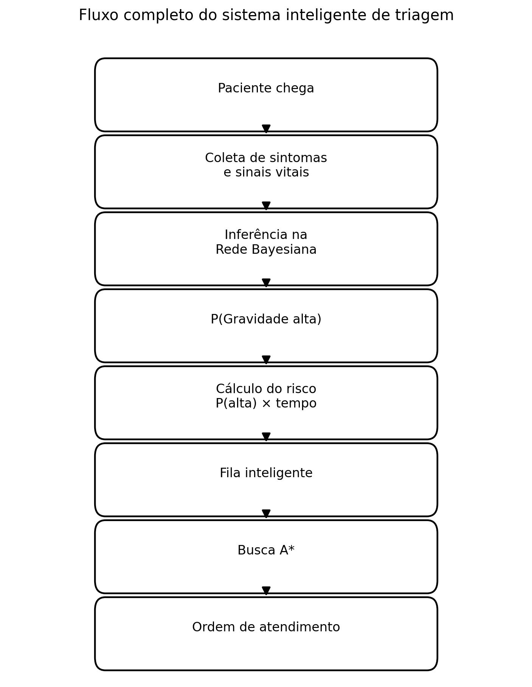
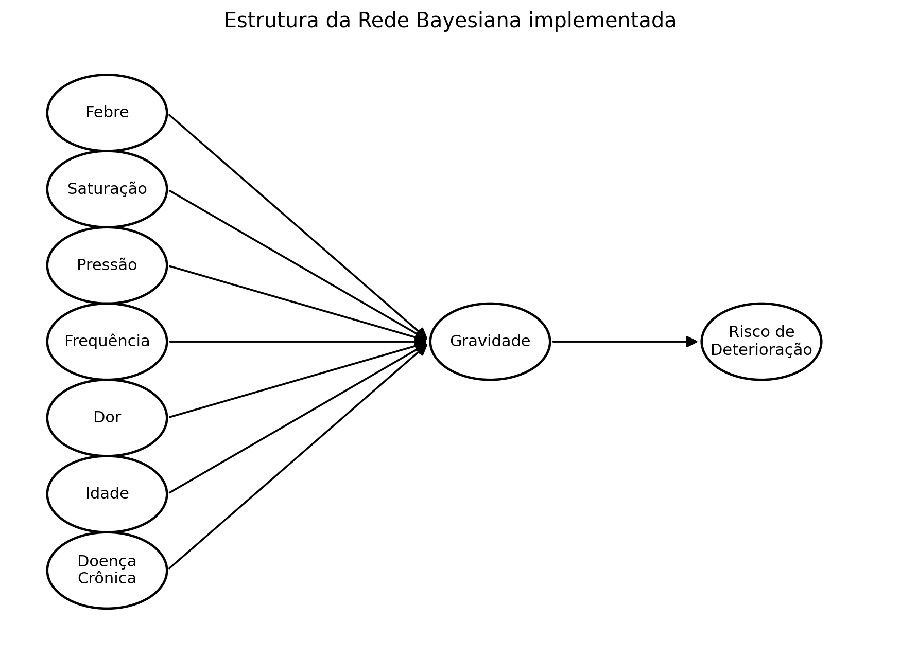
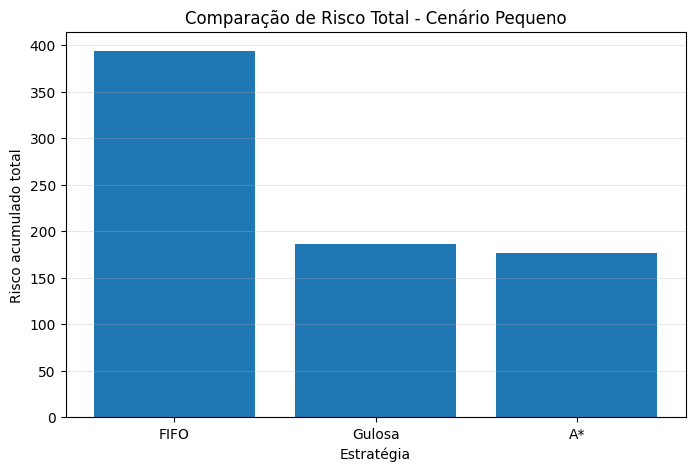
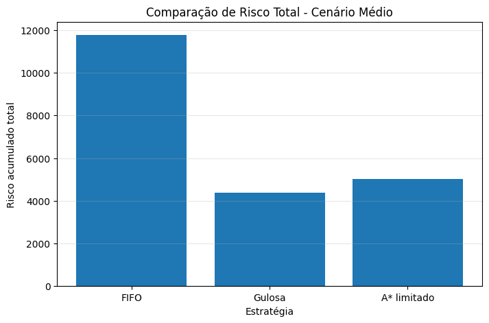

# Sistema Inteligente de Triagem em Pronto-Socorro

Projeto Final da disciplina de **Inteligência Artificial** desenvolvido na **Universidade Federal do Ceará (UFC)**.

O projeto propõe um sistema inteligente de apoio à decisão para triagem em pronto-socorros, integrando uma **Rede Bayesiana** para inferência probabilística da gravidade clínica e o **algoritmo A*** para otimização da ordem de atendimento dos pacientes.

---

# Autores

- Francisco Wilton
- Jardel de Araújo

**Disciplina:** Inteligência Artificial

**Professor:** José Antonio Macedo

**Universidade Federal do Ceará (UFC)**

---

# Objetivo do Projeto

Desenvolver um sistema inteligente capaz de:

- Estimar a gravidade clínica de pacientes a partir de sintomas e sinais vitais utilizando uma **Rede Bayesiana**;
- Calcular o risco de deterioração clínica durante o tempo de espera;
- Determinar automaticamente uma ordem de atendimento utilizando o algoritmo **A***;
- Comparar o desempenho da solução proposta com estratégias tradicionais de atendimento (**FIFO** e **Gulosa**).

---

# Tecnologias Utilizadas

- Python 3
- Google Colab
- pgmpy
- NetworkX
- NumPy
- Pandas
- Matplotlib
- SciPy

---

# Arquitetura do Sistema

O sistema foi dividido em dois módulos principais:

1. **Rede Bayesiana**
   - Inferência probabilística da gravidade clínica.

2. **Algoritmo A***
   - Otimização da ordem de atendimento considerando gravidade e tempo de espera.

<p align="center">

</p>

---

# Modelagem da Rede Bayesiana

A Rede Bayesiana representa as relações probabilísticas entre os sinais clínicos observados e a variável central **Gravidade**, permitindo inferência mesmo diante de informações incompletas.

<p align="center">

</p>

### Variáveis utilizadas

| Variável | Estados |
|----------|----------|
| Febre | Sim / Não |
| Saturação de Oxigênio | Normal / Reduzida / Crítica |
| Pressão Arterial | Normal / Baixa |
| Frequência Cardíaca | Normal / Elevada |
| Dor | Leve / Moderada / Intensa |
| Idade | Jovem / Adulto / Idoso |
| Doença Crônica | Sim / Não |
| Gravidade | Baixa / Média / Alta |
| Risco de Deterioração | Baixo / Médio / Alto |

A inferência foi implementada utilizando o algoritmo **Variable Elimination**, disponível na biblioteca **pgmpy**.

---

# Formulação do Algoritmo A*

O problema foi modelado como um problema clássico de busca.

| Elemento | Descrição |
|----------|-----------|
| Estado | Sequência parcial de pacientes já atendidos |
| Estado Inicial | Nenhum paciente atendido |
| Objetivo | Atender todos os pacientes minimizando o risco acumulado |
| Ação | Escolher o próximo paciente da fila |
| Custo | Soma do risco acumulado dos pacientes que permanecem aguardando atendimento |
| Heurística | Soma dos riscos atuais dos pacientes restantes |

A função de avaliação segue a formulação clássica:

\[
f(n)=g(n)+h(n)
\]

onde:

- **g(n)** representa o risco acumulado;
- **h(n)** estima o risco restante.

---

# Integração entre os Módulos

O fluxo completo do sistema ocorre da seguinte forma:

```text
Paciente
      ↓
Coleta de sintomas e sinais vitais
      ↓
Rede Bayesiana
      ↓
P(Gravidade Alta)
      ↓
Cálculo do risco
      ↓
Algoritmo A*
      ↓
Ordem ótima de atendimento
```

A Rede Bayesiana produz a probabilidade de **Gravidade Alta**, utilizada diretamente pelo algoritmo **A*** para calcular o risco de deterioração clínica e priorizar os pacientes.

---

# Experimentos

Foram comparadas três estratégias de atendimento.

| Estratégia | Descrição |
|------------|-----------|
| FIFO | Atendimento por ordem de chegada |
| Gulosa | Prioriza pacientes com maior probabilidade de gravidade |
| A* | Considera simultaneamente gravidade e tempo de espera |

Foram simulados dois cenários:

- **Cenário Pequeno:** 8 pacientes
- **Cenário Médio:** 25 pacientes

---

# Resultados dos Experimentos

| Cenário | FIFO | Gulosa | A* |
|---------|------:|--------:|---:|
| Pequeno (8 pacientes) | 394.25 | 186.04 | **176.78** |
| Médio (25 pacientes) | 11784.04 | **4389.76** | 5006.92* |

> **Observação:** No cenário médio foi utilizada uma versão limitada do algoritmo A*, restringindo o número máximo de expansões da árvore de busca. Essa adaptação reduz significativamente o custo computacional, porém elimina a garantia de encontrar a solução ótima.

---

## Cenário Pequeno

<p align="center">

</p>

No cenário pequeno, o algoritmo **A*** completo apresentou o menor risco acumulado, confirmando sua capacidade de encontrar a solução ótima.

---

## Cenário Médio

<p align="center">

</p>

No cenário médio, devido ao crescimento fatorial do espaço de busca, foi utilizada uma versão aproximada do algoritmo A*. A estratégia Gulosa apresentou menor risco acumulado, evidenciando a perda de otimalidade causada pela limitação da busca.

---

# Principais Resultados

- Implementação de uma Rede Bayesiana composta por sete variáveis clínicas.
- Inferência probabilística utilizando **Variable Elimination**.
- Integração completa entre Rede Bayesiana e algoritmo **A***.
- Comparação entre estratégias FIFO, Gulosa e A*.
- Melhor desempenho do algoritmo **A*** no cenário pequeno.
- Discussão das limitações computacionais do A* em cenários maiores.

---

# Estrutura do Projeto

```text
sistema-inteligente-triagem-ia/
│
├── README.md
├── requirements.txt
├── Sistema_Inteligente_Triagem_Pronto_Socorro.ipynb
│
├── imagens/
│   ├── rede_bayesiana.png
│   ├── fluxo_integracao.png
│   ├── comparacao_cenario_pequeno.png
│   ├── comparacao_cenario_medio.png
│   ├── inferencia_paciente_alto_risco.png
│   ├── paciente_exemplo.png
│   ├── pesos_cpt.png
│   ├── pipeline_sistema.png
│   ├── pseudocodigo_astar.png
│   └── expansao_estados_astar.png
│
├── relatorio/
│   └── Relatório Final IA - Francisco Wilton e Jardel Araújo.pdf
│
├── docs/
│   └── Trabalho_Final_IA.pdf
│
└── slides_apresentacao/
    ├── Slides_Apresentacao.html
    ├── Apresentação_Sistema_Inteligente_de_Triagem.pdf
    └── imagens_utilizadas/
```

---

# Como Executar

## 1. Clone o repositório

```bash
git clone https://github.com/Araujojardel/sistema-inteligente-triagem-ia.git
```

## 2. Instale as dependências

```bash
pip install -r requirements.txt
```

## 3. Abra o notebook

Abra o arquivo:

```text
Sistema_Inteligente_Triagem_Pronto_Socorro.ipynb
```

no **Google Colab** ou **Jupyter Notebook**.

## 4. Execute o projeto

Execute todas as células em sequência.

Ao final serão gerados automaticamente:

- Estrutura da Rede Bayesiana;
- Inferências probabilísticas;
- Simulação dos pacientes;
- Comparação entre FIFO, Gulosa e A*;
- Gráficos dos experimentos.

---

# Referências

- PEARL, J. *Probabilistic Reasoning in Intelligent Systems*. Morgan Kaufmann, 1988.
- RUSSELL, S.; NORVIG, P. *Artificial Intelligence: A Modern Approach*. 4ª ed. Pearson, 2021.
- HART, P.; NILSSON, N.; RAPHAEL, B. *A Formal Basis for the Heuristic Determination of Minimum Cost Paths*. IEEE Transactions on Systems Science and Cybernetics, 1968.
- KOLLER, D.; FRIEDMAN, N. *Probabilistic Graphical Models: Principles and Techniques*. MIT Press, 2009.
- MANCHESTER TRIAGE GROUP. *Emergency Triage*. Wiley-Blackwell, 2014.

---

# Documentação

O projeto inclui:

- Relatório técnico completo (`relatorio/`);
- Documento com as orientações da atividade (`docs/`);
- Notebook contendo toda a implementação (`Sistema_Inteligente_Triagem_Pronto_Socorro.ipynb`).

---

---

# Vídeo da Apresentação

A apresentação completa do projeto está disponível no YouTube (modo **Não listado**) por meio do link abaixo:

**https://youtu.be/LYgMUM_iMOk**

Também é possível acessar essa informação na pasta:

```text
video/
```

O vídeo demonstra:

- Motivação do problema;
- Modelagem da Rede Bayesiana;
- Formulação do algoritmo A*;
- Integração entre os módulos;
- Execução dos experimentos;
- Comparação entre FIFO, Gulosa e A*;
- Resultados e conclusões.


# Observações

Este projeto possui finalidade exclusivamente **acadêmica** e foi desenvolvido como trabalho final da disciplina de Inteligência Artificial.

As Tabelas de Probabilidade Condicional (CPTs) foram definidas por modelagem heurística inspirada na literatura e na lógica do **Protocolo de Manchester**, não representando um sistema validado para utilização clínica.

---

# Agradecimentos

Agradecemos ao professor **José Antonio Macedo** pela orientação durante a disciplina e pelos conhecimentos compartilhados ao longo do desenvolvimento deste projeto.
